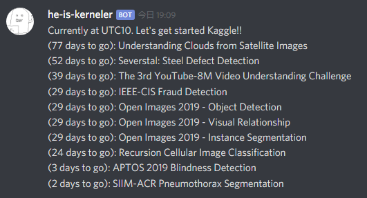

#### English follows Japanese

Heroku とかにあげて `python main` を実行するとDiscordのチャンネルにKaggleのメダル対象のコンペ情報を流してくれます。



<a href="https://heroku.com/deploy?template=https://github.com/regonn/kaggle-discord-bot&env[PRODUCTION]=true">
  
</a>

## 利用している環境変数

次の環境変数を設定してください
`dotenv` を利用する場合には `.env.sample` を参考に `.env` ファイルを作成してください。

```
DISCORD_TOKEN='DISCORDのBOT TOKEN'
KAGGLE_USERNAME='KaggleのUser名(※)'
KAGGLE_KEY='KaggleAPI用のKey(※)'
DISCORD_CHANNEL_ID='DiscordのBOTがつぶやくチャンネル'
PRODUCTION='何も設定されていないと dotenv が呼ばれる開発環境用'
```

(※) KAGGLE系の環境変数は `KaggleApi` が呼ばれたタイミングで必要なので dotenv が利用できないです。
pytho実行環境の環境変数に追加しておくか kaggle.json を設置してください。

## Environment variables

You need these values.
If you use `dotenv`, please create `.env` from `.env.sample`.

```
# Now supports English(en) or Japanese(ja).
LOCALE='en'

# Discord
DISCORD_TOKEN=
DISCORD_CHANNEL_ID=

# These variables are needed for setting local environment variables when import kaggle-api.
# You can also place kaggle.json file in your root directory.
KAGGLE_USERNAME=
KAGGLE_KEY=

# If this key is set, load dotenv values.
# PRODUCTION=True
```
